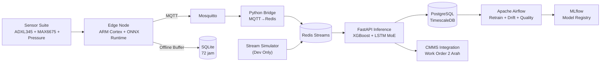

<div align="center">

# ⛏️ PRATYAKSA

### KIDECO INNOVATION CHALLENGE 2026 — Tahap Seleksi

**Predictive Analytics & Traceability for Heavy Asset Condition Surveillance and Actualization**

Sistem AIoT Predictive dan Prescriptive Maintenance untuk Armada Alat Berat Tambang Batubara di Pasir Mine PT. Kideco Jaya Agung


**Tim Oryphem — Politeknik Negeri Samarinda**

</div>

---

## 📋 Daftar Isi

- [Identitas Tim](#-identitas-tim)
- [Ringkasan Eksekutif](#-ringkasan-eksekutif)
- [Masalah & Solusi](#-masalah--solusi)
- [Arsitektur Sistem](#-arsitektur-sistem)
- [Tech Stack](#-tech-stack)
- [Cara Memulai (Quick Start)](#-cara-memulai-quick-start)
- [Daftar Service](#-daftar-service)
- [Daftar Endpoint API](#-daftar-endpoint-api)
- [Testing](#-testing)
- [Struktur Proyek](#-struktur-proyek)
- [Status Prototipe](#-status-prototipe)
- [Kontak](#-kontak)

---

## 👥 Identitas Tim

| Jabatan | Nama | NIM | Program Studi | Peran | LinkedIn |
|---------|------|:---:|---------------|-------|----------|
| **Ketua** | Baits Rika Saputra | 236651071 | D4 Teknik Informatika Multimedia | *Full Stack Developer* (Website) | [LinkedIn](https://www.linkedin.com/in/baits-rika-saputra-807197266/) |
| **Anggota 1** | Virgiawan Prima Rizky | 236652017 | D4 Teknik Informatika Multimedia | *Data & Machine Learning Engineer* | [LinkedIn](https://www.linkedin.com/in/virgiawan-prima-rizky/) |
| **Anggota 2** | Raihan Akbar Ramadhan | 236651032 | D4 Teknik Informatika Multimedia | *UI/UX Designer* | [LinkedIn](https://www.linkedin.com/in/raihan-akbar-ramadhan-59ba56397/) |
| **Anggota 3** | Farhan Raditya Al Gazali | 246661036 | D4 Teknik Rekayasa Komputer | *IoT Engineer* | [LinkedIn](https://www.linkedin.com/in/farhan-raditya/) |

**Email Tim:** brsaputra14@gmail.com

---

## 📝 Ringkasan Eksekutif

PRATYAKSA adalah platform AIoT terintegrasi yang mengubah pendekatan perawatan armada alat berat tambang dari **reaktif menjadi proaktif**. Sistem memantau kondisi komponen kritis secara *real-time* berbasis arsitektur **Edge-Cloud** dengan representasi **Digital Twin** yang tetap beroperasi penuh bahkan di area *blank spot* terdalam pit Pasir Mine.

**Target Dampak:**

| Metrik | Baseline | Target |
|--------|:--------:|:------:|
| Physical Availability (PA) Armada | 82–85% | **90–93%** |
| Pengurangan *Unplanned Downtime* | — | **30–45%** |
| Efisiensi Biaya Pemeliharaan | — | **20–30%** |
| Potensi Penyelamatan Produksi (50 unit) | — | **USD 8–12 Juta/tahun** |
| Latensi *Alert* di Kabin | — | **<500ms** |

---

## 🧩 Masalah & Solusi

### Masalah

Berdasarkan analisis operasional PT. Kideco Jaya Agung (Company Update FY2025 — PT Indika Energy), terdapat lima permasalahan utama:

| # | Masalah | Dampak Finansial |
|---|---------|:----------------:|
| 1 | **Inefisiensi Preventive Maintenance Berbasis Jadwal** | Biaya perbaikan darurat 2–5× lebih mahal |
| 2 | **Dampak Finansial Masif dari *Unplanned Downtime*** | **USD 25.000+ per insiden** |
| 3 | **Tantangan Konektivitas & Kondisi Ekstrem** | Data tidak reliabel, sensor mati prematur |
| 4 | **Model AI *Black-Box* Tidak Terpercaya** | Adopsi sistem rendah |
| 5 | **Risiko Keselamatan pada Komponen Kritis** | Potensi **USD 500.000–2 Juta** per insiden LTI |

### Solusi

PRATYAKSA beroperasi dalam paradigma **Edge-Cloud Continuum** dengan enam lapisan arsitektur:

```
┌─────────────────────────────────────────────────────────────────────────────┐
│ 🌐 LAPISAN 6: MLOps & Continuous Learning                                    │
│     Apache Airflow (weekly retrain + daily drift + daily quality)            │
│     MLflow experiment tracking → zero-downtime model promotion              │
├─────────────────────────────────────────────────────────────────────────────┤
│ 🖥️ LAPISAN 5: Applications & Interfaces                                     │
│     Telegram Bot, CMMS Integration (2 arah)                                 │
├─────────────────────────────────────────────────────────────────────────────┤
│ 💾 LAPISAN 4: Data & Model Storage                                          │
│     PostgreSQL + TimescaleDB (time-series), Redis Cache, MLflow Registry    │
├─────────────────────────────────────────────────────────────────────────────┤
│ 🧠 LAPISAN 3: AI & Analytics Engine                                         │
│     FastAPI — XGBoost (anomaly) + LSTM MoE (RUL) + SHAP + Drift Detection   │
│     Physics-Informed AI: asymmetric loss + PINN penalty + MC Dropout        │
├─────────────────────────────────────────────────────────────────────────────┤
│ 📡 LAPISAN 2: Data Transport & Ingestion                                     │
│     Python MQTT→Redis Bridge / Redis Streams (consumer group)               │
│     Mobile Hotspot 4G/LTE di kabin (tanpa tower gateway eksternal)          │
├─────────────────────────────────────────────────────────────────────────────┤
│ 🔧 LAPISAN 1: IoT & Edge Computing                                           │
│     Sensor ruggedized (IP67) + Edge Node (ARM Cortex) + ONNX Runtime        │
│     Buffer lokal 72 jam → operasi penuh di area blank spot                 │
└─────────────────────────────────────────────────────────────────────────────┘
```

---

## 🏛️ Arsitektur Sistem



### Alur Data Sistem

```
Sensor (6 titik/unit) → Edge Node (ONNX, <500ms)
    ↓ jika online
Mobile Hotspot 4G/LTE → MQTT → Mosquitto → Bridge → Redis Streams
    ↓ jika offline
Buffer SQLite 72 jam → sinkronisasi asinkron saat sinyal pulih
    ↓
FastAPI Inference:
  ├─ XGBoost (3-class anomaly)
  ├─ LSTM MoE (RUL hierarkis)
  ├─ Digital Twin (physics cross-check)
  ├─ SHAP Explainability
  └─ Drift Detection (Z-score real-time)
    ↓
TimescaleDB (sensor + prediksi) ↔ Redis Cache (result:{asset_id}, TTL 1h)
    ↓
Telegram Bot | CMMS (2 arah)
```

### Port yang Digunakan

| Service | Host Port |
|---------|:---------:|
| FastAPI Inference API | **6000** |
| Grafana Dashboard | **6001** |
| MLflow Tracking | **6050** |
| Airflow Webserver | **6080** |
| Prometheus | **6090** |
| Mosquitto MQTT | **6883** |
| Redis | **6379** |
| PostgreSQL (TimescaleDB) | **5432** |

---

## 🛠️ Tech Stack

| Layer | Teknologi |
|-------|-----------|
| **Backend Analytics** | Python FastAPI (ASGI) — XGBoost + LSTM inference, SHAP computation, *prescriptive engine* |
| **Edge Inference** | ONNX Runtime — XGBoost ONNX di ARM Cortex-A53, latensi <500ms |
| **Data Ingestion** | Python (paho-mqtt, redis-py) — MQTT→Redis bridge + Stream Simulator |
| **Message Queue** | Redis 8.0 — Redis Streams dengan *consumer group* per tipe alat |
| **ML/DL** | XGBoost 3.2, Keras 3.14 + TensorFlow 2.21, scikit-learn 1.8 |
| **Explainability** | SHAP 0.51 — TreeExplainer, *waterfall plot* |
| **Database** | PostgreSQL 16 + TimescaleDB — *hypertable* sensor_readings & predictions, kompresi >90% |
| **Monitoring** | Prometheus + Grafana — *latency inference*, *drift metric*, *resource usage* |
| **MLOps** | Apache Airflow 2.9 (DAG scheduling), MLflow 3.13 (experiment tracking, *model registry*) |
| **Alerting** | Telegram Bot API — notifikasi preskriptif ke grup mekanik |
| **Data Processing** | Pandas, NumPy, PyArrow, FastParquet |
| **Orkestrasi** | Docker Compose — semua service dalam satu perintah `docker compose up` |
| **Edge Hardware** | Raspberry Pi Zero 2W / ESP32-S3, Nextion HMI, ADXL345, MAX6675 |
| **Edge OS** | ARM64 Docker (Debian slim) |

---

## 🚀 Cara Memulai (Quick Start)

### Prasyarat

- Docker & Docker Compose
- Python 3.11+ (untuk pengembangan *offline*)
- Git
- Port 6000, 6001, 6050, 6080, 6090, 6379, 5432, 6883 tersedia

### 1. Clone Repository

```bash
git clone https://github.com/virgiawanprima/pratyaksa.git
cd pratyaksa
```

### 2. Konfigurasi Environment

```bash
cp .env.example .env
# Edit .env — isi POSTGRES_PASSWORD dan PRATYAKSA_API_KEYS
```

### 3. Jalankan Seluruh Stack

```bash
docker compose up -d
```

Tunggu beberapa saat hingga semua container siap:

```bash
docker compose ps
# Semua service harus bertuliskan "Up" / "Healthy"
```

### 4. Verifikasi

```bash
# Health check
curl http://localhost:6000/health

# Prediksi sample
curl -X POST http://localhost:6000/predict \
  -H "X-API-Key: YOUR_API_KEY" \
  -H "Content-Type: application/json" \
  -d '{"asset_id":"test-001","equipment_type":"haul_truck","features":[1.0]*37}'
```

### 5. Akses Layanan

| Layanan | URL | Kredensial |
|---------|-----|------------|
| **FastAPI Docs** | http://localhost:6000/docs | — |
| **Grafana** | http://localhost:6001 | `admin` / `pratyaksa2026` |
| **MLflow** | http://localhost:6050 | — |
| **Airflow** | http://localhost:6080 | — |
| **Prometheus** | http://localhost:6090 | — |

### 6. Hentikan Stack

```bash
docker compose down
```

---

---

## 📡 Daftar Service

| Service | Port | Deskripsi |
|---------|:----:|-----------|
| **pratyaksa-redis** | 6379 | Redis 8 — Streams, pub/sub, cache result (TTL 1h) |
| **pratyaksa-postgres** | 5432 | TimescaleDB 16 — *Hypertable* sensor + prediction (*compress* 30d, *retain* 2y) |
| **pratyaksa-api** | 6000 | FastAPI — *Inference engine* (predict, explain, workorder, fleet, health) |
| **pratyaksa-mlflow** | 6050 | MLflow 3.13 — *Experiment tracking* (Postgres backend) |
| **pratyaksa-prometheus** | 6090 | Prometheus — *Metrics scraping* (30d *retention*) |
| **pratyaksa-grafana** | 6001 | Grafana — *Fleet dashboard* + *unified alerting* |
| **pratyaksa-simulator** | — | Simulator data — *replay* parquet → Redis Streams (dev profile) |
| **pratyaksa-airflow-scheduler** | — | Airflow scheduler — *retrain pipeline* |
| **pratyaksa-airflow-web** | 6080 | Airflow webserver — DAG UI |
| **mosquitto** | 6883 | MQTT broker — *edge data ingestion* |
| **pratyaksa-bridge** | — | MQTT→Redis bridge |

---

## 📡 Daftar Endpoint API

| Method | Path | Auth | Deskripsi |
|--------|------|:----:|-----------|
| `GET` | `/health` | ✗ | *Health check* (Redis, Postgres, models) |
| `GET` | `/metrics` | ✗ | Prometheus metrics |
| `POST` | `/predict` | API Key | Prediksi tunggal — risk, RUL, *twin*, *drift* |
| `GET` | `/explain/{prediction_id}` | API Key | SHAP *waterfall plot* (base64 PNG) |
| `POST` | `/workorder` | API Key | Rekomendasi *work order* preskriptif |
| `GET` | `/result/{asset_id}` | API Key | *Latest cached prediction* |
| `GET` | `/fleet` | API Key | *Fleet status* agregat |
| `POST` | `/reload-models` | API Key | *Hot-reload* model tanpa *downtime* |

---

## 🧪 Testing

### Unit Tests

```bash
ENV=development python test_core.py
python test_load.py
```

**Lingkup test:**
- ✅ *Risk resolution* (XGBoost vs LSTM *conflict*)
- ✅ *Hierarchy enforcement* (part ≤ component ≤ system)
- ✅ *Digital Twin* physics models (brake, bearing, hydraulic)
- ✅ *Drift detection* (Z-score)
- ✅ *Dropout flag detection* (flatline, NaN)

---

## 📁 Struktur Proyek

```
pratyaksa/
├── docker-compose.yml               # Orkestrasi 11 service
├── .env.example                     # Template environment variables
├── schema_config.json               # Definisi 37 fitur sensor (4 grup)
├── bridge.py                        # MQTT → Redis Stream bridge
├── export_onnx.py                   # Export XGBoost → ONNX
├── test_core.py                     # Unit test suite
├── test_load.py                     # Load test Keras model
├── requirements-dev.txt             # Dependencies development
├── artifacts/                       # Model artifacts
│   ├── artifact_deploy_meta.json    # Metadata deployment
│   ├── artifact_xgb_model.json      # XGBoost classifier
│   ├── artifact_xgb_model.onnx      # ONNX export (340 KB)
│   ├── artifact_scaler.pkl          # StandardScaler (37 fitur)
│   ├── split_{train,test,val}.parquet
│   ├── artifact_lstm_{type}.keras   # 4 LSTM experts per tipe alat
│   └── *.npy                        # Training arrays
├── api/                             # ☁️ Cloud Backend
│   ├── app.py                       # FastAPI — 8 endpoints
│   ├── prescriptive.py              # Recommendation engine
│   └── requirements.txt             # Dependencies API
├── edge/                            # 📡 Edge Device
│   ├── main.py                      # Main loop: sensor → inference → MQTT
│   ├── inference.py                 # ONNX Runtime orchestrator
│   ├── preprocessor.py              # StandardScaler transform
│   ├── risk_resolver.py             # Risk + Digital Twin resolver
│   ├── digital_twin.py              # Physics model
│   ├── buffer.py                    # SQLite offline buffer (72 jam)
│   ├── mqtt_edge.py                 # MQTT client
│   ├── nextion.py                   # Nextion HMI driver
│   └── drivers/                     # Hardware drivers
│       ├── adxl345.py               # Accelerometer
│       ├── max6675.py               # Thermocouple
│       └── pressure_transducer.py   # Pressure transducer
├── bot/                             # 🤖 Telegram Bot (backup)
│   ├── bot.py                       # Telegram Bot (full, currently disabled)
│   └── bot_simulator.py             # FastAPI alert sender
├── simulator/                       # 🔄 Data Simulator
│   └── stream_simulator.py          # Replay parquet → Redis
├── airflow/dags/                    # 🏭 MLOps Pipeline
│   ├── retrain_pipeline.py          # Weekly retrain
│   ├── data_quality_check.py        # Daily null check
│   └── drift_detection.py           # Daily KS-test drift
├── monitoring/
│   └── prometheus.yml               # Prometheus config
├── database/
│   └── schema.sql                   # TimescaleDB schema (320 lines)
├── notebooks/                       # 📓 Jupyter Notebooks
│   ├── data_pipeline.ipynb
│   └── model_pipeline.ipynb
├── docker-container/                # Dockerfiles
│   ├── api/Dockerfile
│   ├── bridge/Dockerfile
│   ├── airflow/Dockerfile
│   ├── simulator/Dockerfile
│   ├── jupyter/Dockerfile
│   
└── data/
    ├── dataset_pratyaksa_pilot.parquet
    ├── dataset_pratyaksa_noisy.parquet
    └── daily/                       # Airflow daily mount
```

---

## ✅ Status Prototipe

| Kategori | Status |
|----------|:------:|
| **Data Pipeline** (6-Stage) | ✅ Selesai |
| **Model AI Terlatih** (XGBoost + 4 LSTM Experts) | ✅ Selesai |
| **Backend Fungsional** (FastAPI, Redis Streams, Bridge) | ✅ Selesai |
| **MLOps Stack** (Airflow, MLflow) | ✅ Selesai |
| **Database** (TimescaleDB hypertables + aggregasi) | ✅ Selesai |
| **Docker Compose** (semua service *one-command up*) | ✅ Selesai |
| **Edge Device** (ONNX + buffer + MQTT) | ✅ Selesai |
| **Digital Twin** (physics cross-check) | ✅ Selesai |

> **11 service** — seluruhnya dapat dijalankan dengan `docker compose up`.

---

## 📬 Kontak

**PRATYAKSA** dipersembahkan oleh Tim Oryphem untuk **Kideco Innovation Challenge (KIC) 2026**.

| | |
|---|---|
| 🏫 **Perguruan Tinggi** | Politeknik Negeri Samarinda |
| 🏆 **Kompetisi** | Kideco Innovation Challenge 2026 |
| 👨‍💼 **Ketua Tim** | Baits Rika Saputra — brsaputra14@gmail.com |
| 👨‍💻 **Kontak** | [Virgiawan Prima Rizky](https://www.linkedin.com/in/virgiawan-prima-rizky) |
| 📂 **Repository** | [github.com/virgiawanprima/pratyaksa](https://github.com/virgiawanprima/pratyaksa) |

---

<div align="center">

**⛏️ PRATYAKSA — AIoT Predictive + Prescriptive Maintenance**

*Mewujudkan Zero Unplanned Breakdowns melalui Kecerdasan Buatan dan Internet of Things*

Tim Oryphem — Politeknik Negeri Samarinda — KIC 2026

</div>
